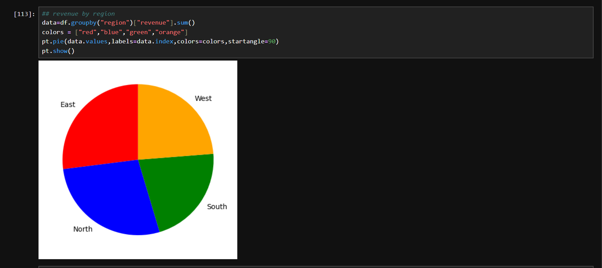
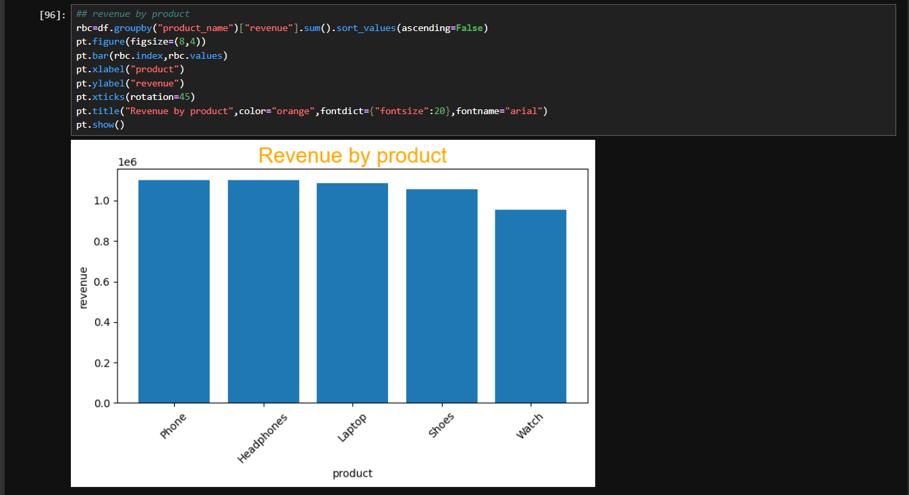
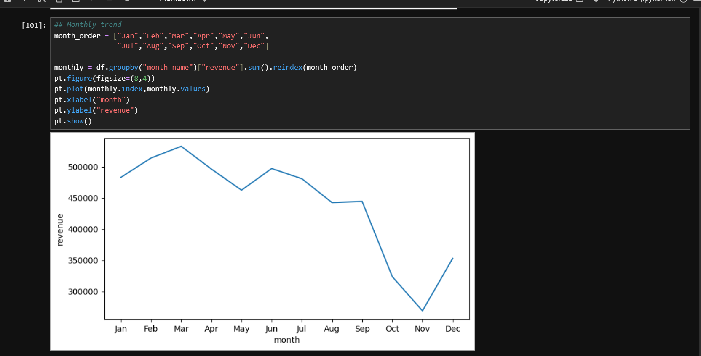
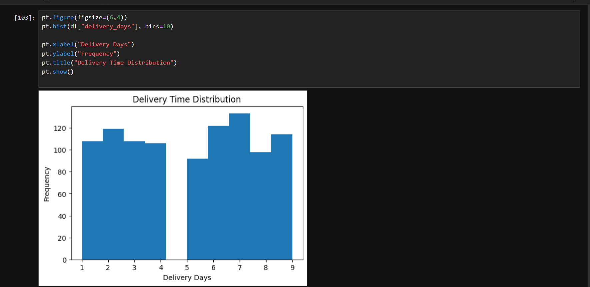

# Ecommerce-Behaviour-Analysis

## Overview

This project analyzes ecommerce customer behaviour, sales trends, revenue patterns, and return rates using Python, Pandas, SQL, and Matplotlib.

## Tools Used

* Python
* Pandas
* SQL
* Matplotlib
* Jupyter Notebook

## Project Workflow

1. Data Cleaning and Preprocessing
2. Exploratory Data Analysis (EDA)
3. Revenue Analysis
4. Customer Behaviour Analysis
5. Return Rate Analysis
6. Data Visualization
7. Business Insights Generation

## Key Analysis

* Revenue by Region
* Revenue by Product
* Revenue by Category
* Monthly Sales Trends
* Flash Sale Performance
* Return Rate Analysis
* Customer Type Analysis

## Files

* `Ecommerce_Data_Analysis.ipynb` – Complete Python analysis
* `ecommerce_analysis.sql` – SQL queries used for analysis
* `ecommerce_behavior.csv` – Dataset used in the project

## Project Screenshots

### Revenue by Region

### Revenue by Product

### Monthly Sales Trend

### Delivery Time Distribution

## Skills Demonstrated

Python | Pandas | SQL | Data Cleaning | EDA | Data Visualization | Business Analytics

